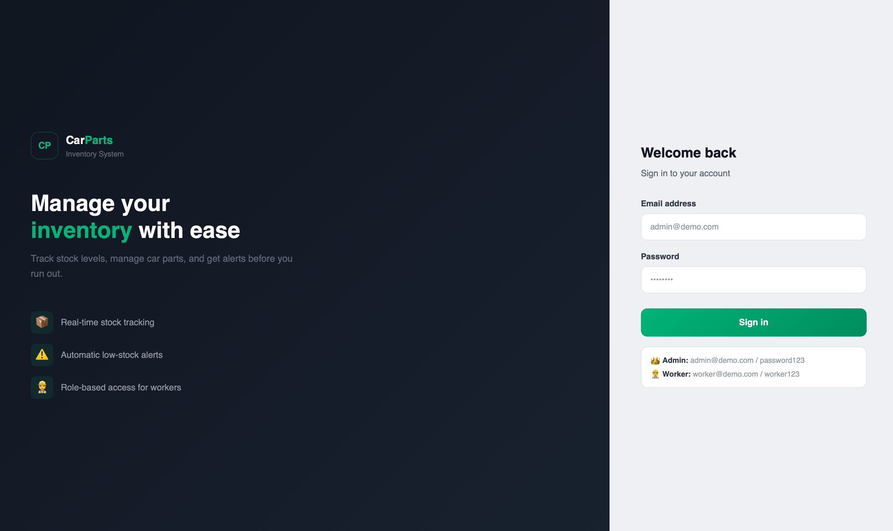
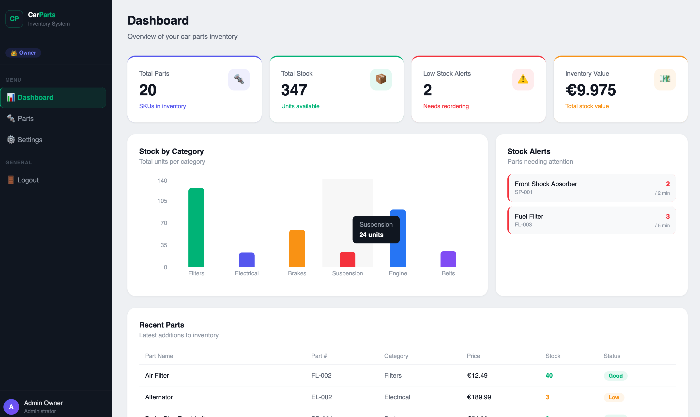
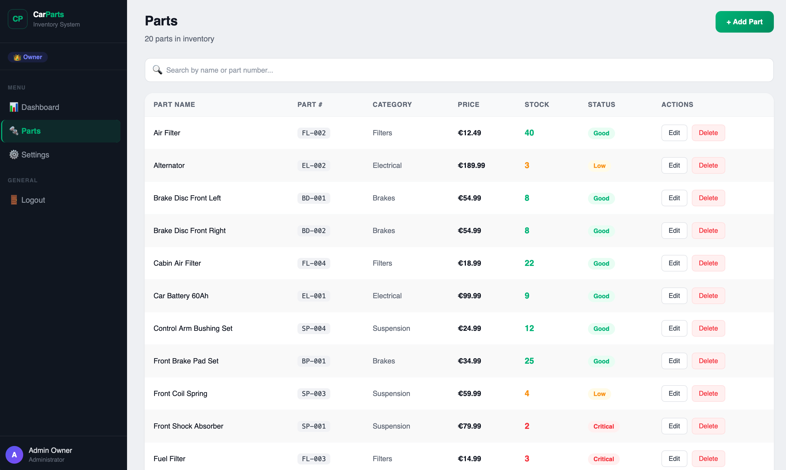
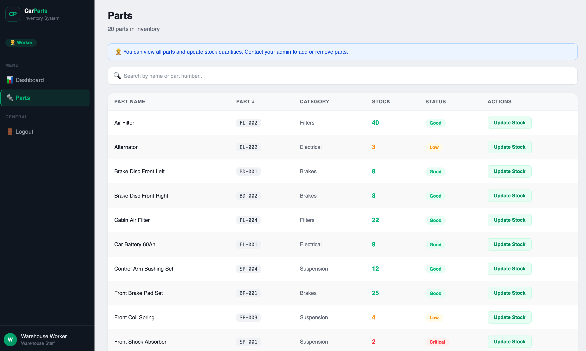
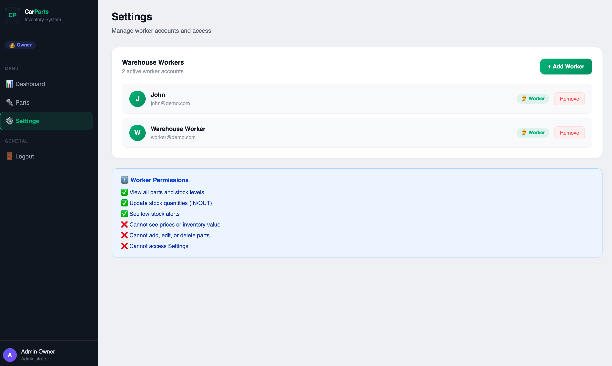

# 🔧 Car Parts Inventory System

A full-stack web application for managing car parts inventory — built for small automotive businesses that want to move away from spreadsheets and into a proper, real-time stock management solution.

> **Live Demo:** [carparts-inventory-system.vercel.app](https://carparts-inventory-system.vercel.app) &nbsp;|&nbsp; **API:** [carparts-backend-03mj.onrender.com](https://carparts-backend-03mj.onrender.com/api/health)


---

## 📸 Screenshots

| Login | Dashboard |
|-------|-----------|
|  |  |

| Parts (Admin) | Parts (Worker) |
|---------------|----------------|
|  |  |

| Settings |
|----------|
|  |
---

## ✨ Features

- **Parts management** — Full CRUD for car parts with part number, category, price, and stock quantity
- **Role-based access control** — Owner (admin) and Warehouse Worker roles with different permissions
- **Real-time stock tracking** — Color-coded indicators (🟢 Good / 🟡 Low / 🔴 Critical)
- **Low-stock alerts** — Automatic flagging of parts below reorder level
- **Stock transactions** — Workers can log stock IN/OUT with notes
- **Worker management** — Admin can create and remove worker accounts from Settings
- **Dashboard overview** — Summary cards and bar chart showing stock by category
- **Secure authentication** — JWT-based login with role-aware routing
- **Fully containerised** — Run the entire stack with one Docker command
---

## 🛠️ Tech Stack

| Layer | Technology |
|-------|-----------|
| Frontend | React 18, Vite, Tailwind CSS, shadcn/ui, Recharts |
| Backend | Node.js, Express.js, Zod (validation) |
| Database | PostgreSQL 15, Knex.js (migrations & query builder) |
| Auth | JSON Web Tokens (JWT), bcrypt |
| Testing | Jest, Supertest |
| DevOps | Docker, Docker Compose, GitHub Actions CI |
| Deployment | Vercel (frontend), Render (backend + DB) |

--- 

## 🚀 Getting Started

### Prerequisites

- [Node.js](https://nodejs.org/) v18+
- [Docker](https://www.docker.com/) & Docker Compose
- [Git](https://git-scm.com/)

### Option A — Run with Docker (recommended)

```bash
git clone https://github.com/Moameira/car-parts-inventory.git
cd car-parts-inventory
cp .env.example .env
docker compose up --build
```

The app will be available at:
- Frontend: http://localhost:5173
- Backend API: http://localhost:3000
- Default admin login: `admin@demo.com` / `password123`
- Default Worker login `worker@demo.com`/ `worker123`


### Option B — Run locally without Docker

**1. Clone the repo and install dependencies**

```bash
git clone https://github.com/Moameira/car-parts-inventory.git
cd car-parts-inventory

# Install backend dependencies
cd backend && npm install

# Install frontend dependencies
cd ../frontend && npm install
```

**2. Set up the database**

Create a PostgreSQL database, then copy and fill in the environment file:

```bash
cd backend
cp .env.example .env
# Edit .env with your DB credentials
```

**3. Run migrations and seed data**

```bash
cd backend
npm run migrate
npm run seed
```

**4. Start the development servers**

```bash
# Terminal 1 — backend
cd backend && npm run dev

# Terminal 2 — frontend
cd frontend && npm run dev
```

---

## 🗂️ Project Structure

```
car-parts-inventory/
├── backend/
│   ├── src/
│   │   ├── controllers/     # Request handlers
│   │   ├── routes/          # Express route definitions
│   │   ├── middleware/       # Auth, validation, error handling
│   │   └── db/              # Knex config, migrations, seeds
│   ├── tests/               # Jest + Supertest API tests
│   └── Dockerfile
├── frontend/
│   ├── src/
│   │   ├── components/      # Reusable UI components
│   │   ├── pages/           # Route-level page components
│   │   ├── hooks/           # Custom React hooks
│   │   └── api/             # API client (fetch wrappers)
│   └── vite.config.ts
├── docker-compose.yml
└── .github/
    └── workflows/
        └── ci.yml           # GitHub Actions CI pipeline
```

---

## 🔌 API Endpoints

| Method | Endpoint | Description |
|--------|----------|-------------|
| `POST` | `/api/auth/login` | Authenticate and receive JWT |
| `GET` | `/api/parts` | List all parts (supports `?search=`, `?category=`) |
| `POST` | `/api/parts` | Create a new part |
| `PUT` | `/api/parts/:id` | Update a part |
| `DELETE` | `/api/parts/:id` | Delete a part |
| `GET` | `/api/parts/low-stock` | List parts below reorder level |
| `GET` | `/api/categories` | List all categories |
| `GET` | `/api/transactions` | View stock transaction history |

All protected endpoints require the header: `Authorization: Bearer <token>`

---

## 🧪 Running Tests

```bash
cd backend
npm test
```

Tests cover all CRUD endpoints, authentication, input validation edge cases, and the low-stock alert logic.

---

## 🌍 Deployment

The application is deployed across two platforms:

- **Frontend** — Vercel (auto-deploys from `main` branch)
- **Backend + Database** — Render (Docker-based deployment with managed PostgreSQL)

Environment variables required in production:

```
DATABASE_URL=
JWT_SECRET=
NODE_ENV=production
CORS_ORIGIN=https://your-frontend.vercel.app
```

---

## 🗺️ Roadmap

- [ ] Export inventory to CSV / Excel
- [ ] Supplier management module
- [ ] Email notifications for low-stock alerts
- [ ] Multi-user roles (admin vs. warehouse staff)
- [ ] Barcode scanning support

---

## 🤝 Contributing

Pull requests are welcome. For major changes, please open an issue first to discuss what you'd like to change.

---

## 📄 License

[MIT](./LICENSE)

---

## 👤 Author

**Mohamed Ameira**  
Computer Science student @ Fachhochschule Münster  
[LinkedIn](https://linkedin.com/in/mohamed-ameira) · [GitHub](https://github.com/Moameira)

> Built as a portfolio project to demonstrate full-stack development skills with React, Node.js, PostgreSQL, and Docker.
